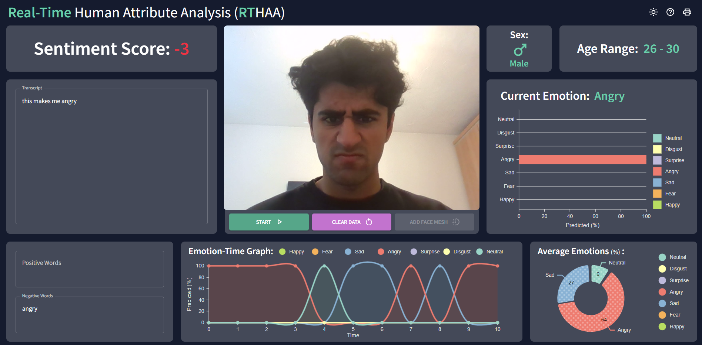
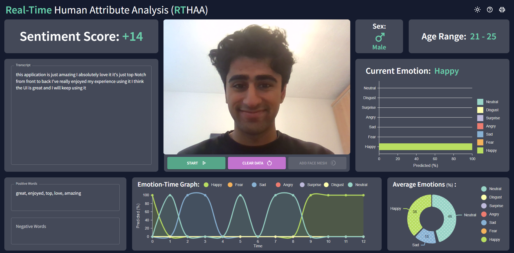
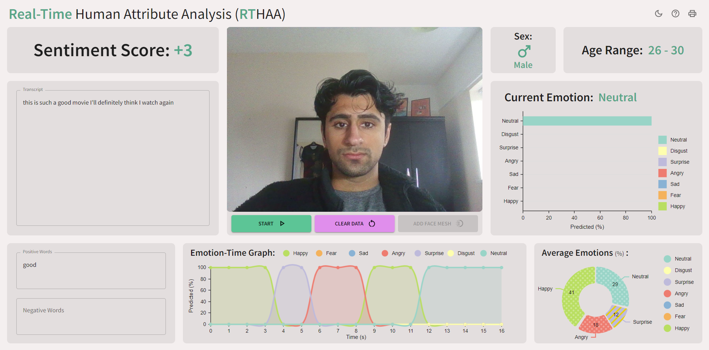
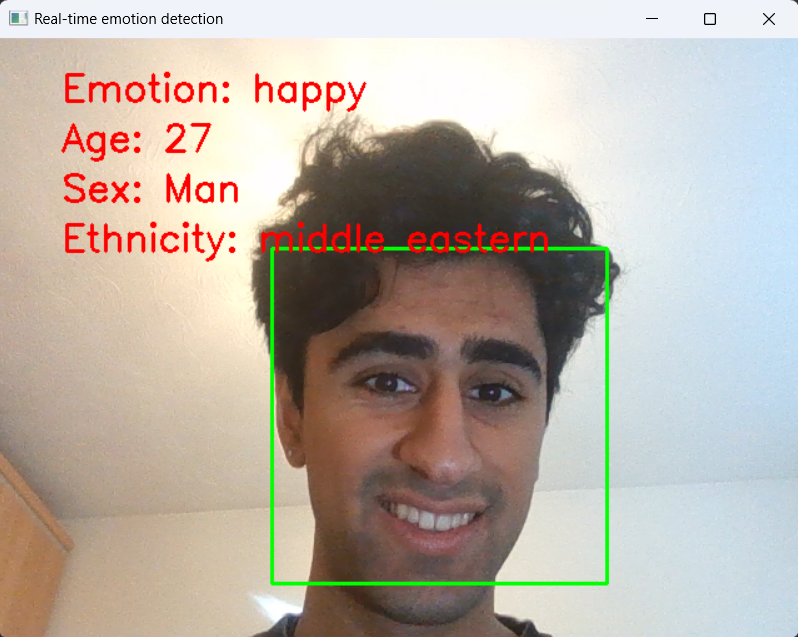
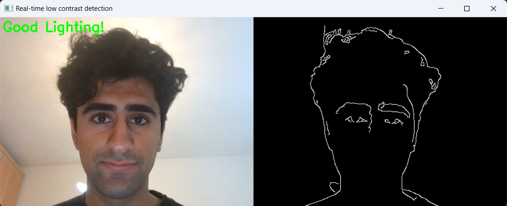
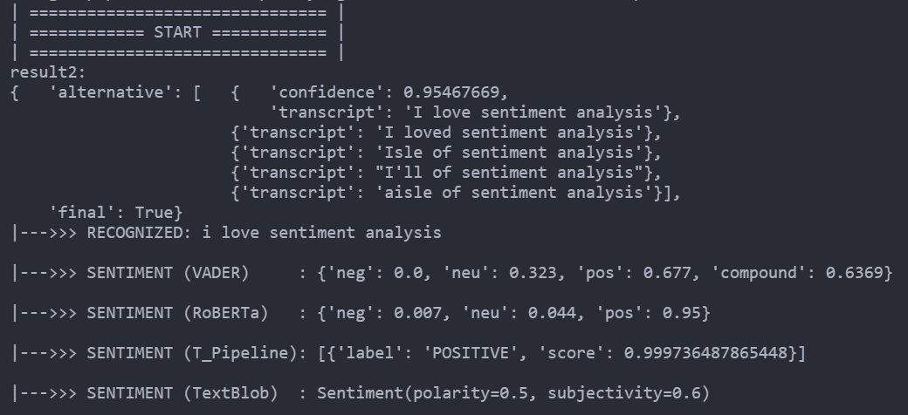
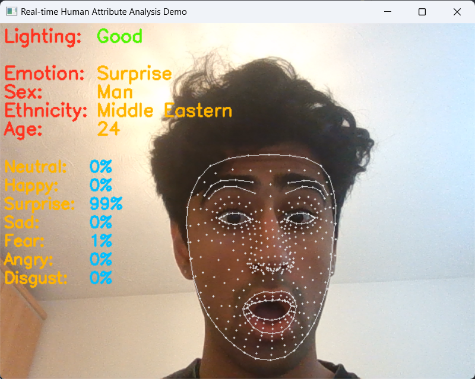

# **Third Year Project: Real-time Human Attribute Analysis Web Application** 

<!-- # Check things are runnable
# Screenshots of demos
# Precise instructions on how to run things
# MAKE REPO PUBLIC
# DO FINAL CHECK OF EVERYTHING, REMOVE BAD COMMENTS ETC. UNI FORMAT -->

### Author: `Neema Raiyat`

---

# What is RTHAA?

Emotions form the fundamental basis for physical communication between humans. They give us a glimpse about our thought process and an insight of what is going on inside the mind. Therefore, measuring the changes in emotion induced by products is clearly an object of interest for businesses. Many existing systems that measure and monitor a human's emotion are restricted as they are unimodal, i.e. they use only a single channel of sensory input and hence are less reliable. RTHAA (pronounced: "Arthur") is a multimodal web application developed using React.js capable of, *real-time human attribute analysis* (RTHAA), that not only monitors a human's emotions using their facial expression, using deep learning, but also measures their speech-content sentiment, using sentiment analysis, resulting in a more comprehensive and robust tool. Other human attributes like age and sex are also measured as they can provide useful data on how different demographics interact with the system. User testing with people of varying ages, sexes and ethnicities showed that our application can more reliably measure a human's overall impression of a system compared to contemporary tools.

> Angry face, negative sentiment, dark colour theme:



> Happy Face, positive sentiment, dark colour theme:



> Neutral Face, neutral sentiment, light colour theme:



# Navigating this repo

The directory skeleton of the key directories/files is as follows:

```
3rd-Year-Project-RTHAA/
├── code/
│   ├── backend-processing-architecture/
│   ├── demos/
│   │   ├── fer_model/
│   │   ├── lc_model/
│   │   └── sa_model/
│   └── rthaa-web-app/
├── docs/
│   ├── diagrams/
│   └── images/
├── README.md
└── dissertation.pdf
```

* `code` - Contains 3 items:

    * `backend-processing-architecture` - A React app that utilizes a server in to process user data

    * `demos` - Contains demos (that can be run locally) of the various models used in RTHAA

    * `rthaa-web-app` - A React app where user data processing is done entirely in the browser

* `docs` - Contains relevant project images and diagrams used in the `dissertation.pdf`

# Running demos

> Ensure you have the required packages installed: DeepFace, OpenCV, numpy, scikit-image, mediapipe etc.

Navigate to `/code/demos` which contains all the demos:

## Facial Expression Recognition (FER) demo

* `/fer_model` - Real-time **Facial Expression Recognition**, ethnicity, age and sex detection. This can be run as follows:

```bash
python fer_model/fer_demo.py
```



## Low-Contrast (LC) demo

* `/lc_model` - Real-time **low-contrast** detection, i.e. detects poor lighting environments. This can be run as follows:

```bash
python lc_model/lc_demo.py
```


## Sentiment Analysis (SA) demo

* `/sa_model` - Real-time **sentiment analysis**, based off of user's speech, picked up from microphone. . This can be run as follows:
```bash
python sa_model/sa_demo.py
```



## Facial Landmark demo

* `demo.py` - Does FER, LC and Facial landmark detection
```bash
python demo.py
```



# Running RTHAA

> Make sure browser is chromium-based for the best experience!

RTHAA was the final software output developed in this project. Its source code can be located in `/code/rthaa-web-app`. This directory contains two important directories and a file:

* `/public` contains pre-trained models used from **face-api.js**

* `/src` contains source code

* `package.json` specifies required packages

In order to run RTHAA:

1. Install Node.js.

2. Initialise a new React.js project, one way of doing so is by running `npm create-react-app` in the terminal.

3. Replace the `public` and `src` folders in this project with RTHAA's `public` and `src` folders, and also copy the `package.json` and `package-lock.json` into the parent folder of the project, it should have the same structure as the `/rthaa-web-app` folder.

4. Run `npm i` to install all package dependencies

5. Run `npm start` to launch the application (on port 3000 by default)

## Navigating RTHAA's subfolders

Contained in the `src` folder are 3 other folders. The `charts` folder contains the data visualization components, the `components` folder contains the dashboard components and the `global` folder contains the high level, large components, i.e. the dashboard and header component. The most important file in the code for RTHAA, is `Dashboard.jsx`, contained in the `global` folder. This component contains all the other UI and data visualization components, as well as the data logic.

When looking into the `src` folder, `Index.js` is responsible for rendering the main React component, `App.js`, into the DOM. `App.js` is the main entry point for the application. It is the top-level component that is responsible for rendering all other components and content of the application. `index.css` simply contains some basic styling for the page. `theme.js` contains the colour theme used in RTHAA.

The `public` folder contains the `models` folder which contains the pre-trained models used from **face-api.js**.

---


# Running Backend-Processing Architecture

This was the intial application developed in the first few sprints of the development phase of the project, and was later abandond due to performance reasons as discussed in Sections 5.1 and 6.1 of the final report. 

In order to run:

1. Install Node.js, Python 3 and Flask
2. Initialise a new React.js project, one way of doing so is by running `npm create-react-app` in the terminal.
3. Replace the `public` and `src` folders in this project with RTHAA's `public` and `src` folders, and also copy the `package.json` and `package-lock.json` into the parent folder of the project, it should have the same structure as the `/rthaa-web-app` folder.
4. Run `npm i` to install all package dependencies
5. Run `npm start` to launch the application (on port 3000 by default), and in another terminal, run the python server `server.py`. Running the python server will depend on your environment variables, but in most cases, running `python server.py` should work. When running the server, errors may rise due to packages not being installed. To install said packages run `pip install` followed by the library name, for example `pip install deepface` to install the deepface library.